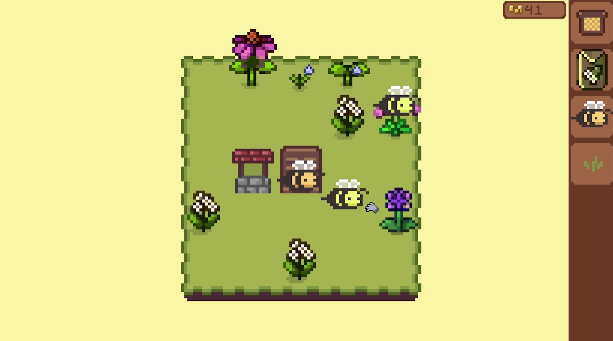

# 🐝 Beetopia — 2D Idle Simulation Game Built with Unity

**Beetopia** is a 2D idle-style simulation game developed using the Unity engine. The player manages a virtual beehive, places buildings, interacts with the environment, and controls automated bee units that perform tasks and gather nectar.




---

## 🔧 Key Features

- 🏗 **Grid-Based Placement System** — intuitive object placement with real-time visual feedback.
- 🐝 **Autonomous Bee Units** — AI-controlled bees execute tasks such as collecting nectar, watering plants, delivering items, and building structures.
- 🌱 **Plant Lifecycle** — crops grow through multiple visual phases, require watering, and produce harvest.
- 💧 **Task System** — plants automatically generate tasks when they need water or have nectar to collect.
- 📦 **Storage & Delivery Logic** — based on a flexible `IItemStorage` interface for transferring resources.
- 🛍 **Shop UI** — allows the player to purchase new structures, bees, and upgrades.
- 🌍 **World Expansion System** — unlock new grid areas dynamically.
- 💾 **Save System** — game state is serialized and stored in JSON format.

---

## 🧪 Technologies Used

- Unity 6 (6000.0.23f1)
- DOTween
- ScriptableObject-driven configs
- Custom Service Locator
- Canvas UI Toolkit

---

## ▶️ Getting Started

1. Clone the repository:
   ```bash
   git clone https://github.com/Zonh-Off/beetopia.git
2. Open the project in Unity 6 (6000.0.23f1) or newer.
3. Open and run the Level0 scene.
